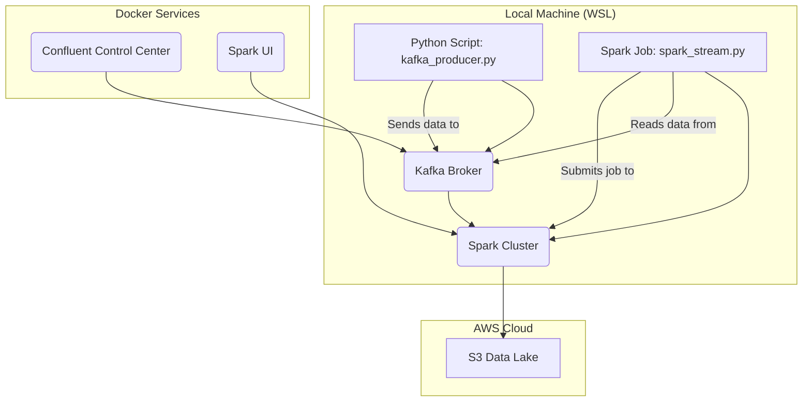

# Real-Time Data-Engineering-Project-on-AWS

This project demonstrates a real-time data engineering pipeline using a modern, scalable tech stack. The core idea is to stream data from a public API, process it with Spark, and store it in a data lake on AWS S3.

## Architecture

The architecture is designed to be simple and robust. Core services like Kafka and Spark run in Docker, while the data producer and consumer scripts are run locally (e.g., in WSL). This provides a flexible development environment.



### Workflow

1.  **Run Services**: The backing services (Kafka, Zookeeper, Spark, etc.) are started using `docker-compose`.
2.  **Produce Data**: You manually run the `kafka_producer.py` script. It fetches user data from a public API and streams it into a Kafka topic.
3.  **Process Data**: You manually run the `spark_stream.py` script. It connects to the Spark cluster and reads from the Kafka topic, processes the data, and writes it to an S3 bucket in Parquet format.
4.  **Monitor**: You can use the Confluent Control Center UI to monitor the Kafka topics and the Spark UI to monitor the Spark jobs.

## Tech Stack

-   **Real-time Messaging**: Apache Kafka
-   **Data Processing**: Apache Spark
-   **Data Lake**: AWS S3
-   **Containerization**: Docker & Docker Compose
-   **Monitoring**: Confluent Control Center & Spark UI

## Getting Started

Follow these steps to set up and run the project.

### Prerequisites

-   [Docker](https://www.docker.com/products/docker-desktop) and Docker Compose
-   An [AWS Account](https://aws.amazon.com/free/) with an S3 bucket
-   A local Python environment (e.g., in WSL).

### 1. Setup Your Local Python Environment

It is highly recommended to use a Python virtual environment to manage your project's dependencies.

1.  **Create a virtual environment**:
    ```bash
    python3 -m venv venv
    ```
2.  **Activate the virtual environment**:
    ```bash
    source venv/bin/activate
    ```
    _You will need to run this activation command every time you open a new terminal to work on this project._

3.  **Install the required libraries**:
    ```bash
    pip install pyspark kafka-python requests
    ```

### 2. AWS Setup

1.  **S3 Bucket**: Create a standard S3 bucket.
2.  **IAM User**: Create an IAM user with programmatic access and attach a policy that grants it read/write access to your S3 bucket.
3.  **Local Credentials**: Create a `.env` file in the project root and add your AWS credentials:
    ```
    AWS_ACCESS_KEY_ID=YOUR_AWS_ACCESS_KEY_ID
    AWS_SECRET_ACCESS_KEY=YOUR_AWS_SECRET_ACCESS_KEY
    ```

### 3. Configuration

-   Open `spark_stream.py` and find the line `parquet("s3a://my-amazing-app/users/")`. Replace `my-amazing-app` with your S3 bucket name.

### 4. Running the Pipeline

Ensure your virtual environment is activated (`source venv/bin/activate`) before running the following commands.

1.  **Start the Services**: Open a terminal and run:
    ```bash
    docker-compose up -d --build
    ```
2.  **Start the Spark Job**: In a separate terminal, run the Spark consumer. This job will wait for data from Kafka.
    ```bash
    python spark_stream.py
    ```
3.  **Start the Kafka Producer**: In another terminal, run the Kafka producer to start sending data.
    ```bash
    python kafka_producer.py
    ```

### 5. Accessing the UIs

-   **Spark Master UI**: `http://localhost:9090`
-   **Confluent Control Center**: `http://localhost:9021`
