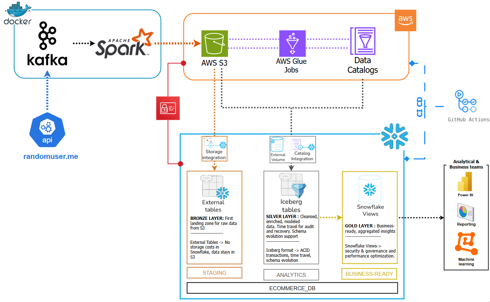

# Personal Data Engineering Learning Project

## Educational Journey & Project Overview

This is my **first personal end-to-end data engineering project**, developed as part of an intensive learning journey over the past month. The project demonstrates modern data engineering practices using cloud-native technologies and open-source tools.

### Learning Objectives & Skills Acquired

During this project, I've gained hands-on experience with:

- **Apache Spark** for distributed data processing and analytics
- **Apache Kafka** for real-time data streaming and message queuing
- **AWS Services**: Glue, S3, Athena, and Data Catalog management
- **Table Formats**: Deep comparison between Apache Iceberg and Delta Lake
- **Catalog Management**: AWS-managed vs Snowflake-managed strategies
- **Data Pipeline Architecture**: Medallion architecture implementation
- **Infrastructure as Code**: Docker, CI/CD with GitHub Actions

### Technology Choices & Rationale

**Apache Iceberg over Delta Lake**: Selected for its superior Snowflake compatibility and mature ecosystem integration. Provides ACID transactions, schema evolution, and time travel capabilities essential for production-grade data lakes.

**AWS Glue Data Catalog**: Chosen for centralized metadata management, enabling seamless integration between AWS services and external tools like Snowflake.

**Hybrid Cloud Architecture**: Demonstrates modern data warehouse patterns by combining AWS services with Snowflake for optimal performance and flexibility.


## Project Data Flow
The project implements a multi-layer data pipeline following the medallion architecture:


### Data Pipeline Layers

#### 1. BRONZE LAYER (Raw Data Ingestion)
- **Real-time streaming** with Apache Kafka
- **Batch processing** with AWS Glue ETL jobs
- **Data storage** in S3 as Parquet files with Iceberg table format
- **Source**: RandomUser API providing realistic user demographic data

#### 2. SILVER LAYER (Data Transformation & Quality)
- **Data cleaning and enrichment** with comprehensive validation
- **Quality scoring** based on completeness, validity, and consistency
- **Schema standardization** across all data sources
- **Partitioning strategy** for optimal query performance

#### 3. GOLD LAYER (Analytics & Business Intelligence)
- **Business metrics calculation** for user demographics and behavior
- **Dimensional modeling** with fact and dimension tables
- **Analytics-ready datasets** optimized for BI tools
- **Aggregated insights** for decision-making

#### 4. DATA CONSUMPTION & VISUALIZATION
- **Snowflake integration** for enterprise data warehousing
- **Query optimization** leveraging Iceberg's advanced features
- **BI tools ready** for visualization and reporting

## Current Implementation Status

### ✅ Completed Features

- **Multi-job Glue pipeline** with comprehensive data processing
- **Iceberg table format** implementation with intelligent partitioning
- **AWS Glue Data Catalog** integration for metadata management
- **Snowflake connectivity** and data consumption layer
- **Real-time streaming** pipeline foundation with Kafka
- **Data quality framework** with scoring and validation
- **Environment-specific SQL generation** from templates
- **Automated CI/CD deployment** via GitHub Actions
- **Multi-environment support** (dev, staging, prod)

### 🔄 Planned Enhancements

- **Visualization tools**: Apache Superset and Microsoft Power BI integration
- **Workflow orchestration**: Apache Airflow for pipeline scheduling and monitoring
- **Alternative stack**: Migration to Databricks + Delta Lake for comparison
- **Multi-Cloud**: Azure cloud provider exploration
- **Advanced streaming**: Apache Flink for complex event processing
- **Monitoring**: Data quality alerts and pipeline observability
- **DevOps**: Enhanced CI/CD with infrastructure as code

## Quick Start Guide

### Prerequisites
- Docker and Docker Compose
- Python 3.8+
- AWS CLI configured (optional for cloud features)
- Make (optional, for convenient commands)

### Step 1: Environment Setup
```bash
# Clone the repository
git clone <your-repo-url>
cd data-project-1

# Quick setup with Make (recommended)
make quick-setup

# OR manual setup
pip install -r requirements.txt

# Configure environment (optional for cloud features)
cp env.example .env
# Edit .env with your AWS and Snowflake credentials

# Start infrastructure services
docker-compose up -d
```

### Step 2: Generate Environment-Specific SQL Files
```bash
# Generate SQL files for all environments
make generate-all-sql

# OR generate for specific environment
make generate-sql ENV=dev     # Development
make generate-sql ENV=staging # Staging  
make generate-sql ENV=prod    # Production

# OR use Python script directly
python scripts/generate_snowflake_sql.py dev
```

### Step 3: Run the Data Pipeline
```bash
# Execute the complete pipeline
python realtime_pipeline.py

# Set up AWS Glue Data Catalog tables
python scripts/setup_all_catalog_tables.py

# Run individual Glue jobs (if AWS configured)
python scripts/run_glue_jobs.py
```

### Step 4: Deploy Snowflake Components
```bash
# Use generated SQL files for your environment
# Example for dev environment:
# Execute files in generated_sql/dev/ in order:
# 1. 02_create_file_formats.sql
# 2. 03_bronze_layer.sql  
# 3. 04_bronze_checks.sql
# 4. 05_silver_layer.sql
# 5. 06_gold_layer.sql
# 6. 07_final_checks.sql
```

### Step 5: Verify Results
```bash
# Check local output
ls -la output/

# Validate AWS Glue tables (if configured)
python scripts/validate_setup.py

# Check generated SQL files
make test-sql

# Show project status
make status
```

## Data Schema & Quality Framework

### User Data Schema
Each processed user record includes:
- **Identity**: Unique ID, full name components
- **Demographics**: Age, gender, generation classification
- **Contact**: Email (validated), phone (formatted), address components
- **Account**: Username, registration date, tenure category
- **Quality Metrics**: Data completeness score, validation flags

### Data Quality Scoring
The pipeline implements a comprehensive quality framework:
- **Email Validation**: Format and domain verification
- **Phone Validation**: International format standardization
- **Completeness Scoring**: Field-level completeness assessment
- **Consistency Checks**: Cross-field validation rules

## Project Structure

```
data-project-1/
├── realtime_pipeline.py           # Main pipeline orchestrator
├── docker-compose.yml             # Infrastructure services
├── requirements.txt               # Python dependencies
├── project_flow.png              # Architecture diagram
├── 
├── glue_jobs/                     # AWS Glue ETL jobs
│   ├── 01_raw_data_transformation.py
│   ├── 02_analytics_aggregation.py
│   └── 03_time_series_analysis.py
├── 
├── scripts/                       # Utility and setup scripts
│   ├── setup_all_catalog_tables.py
│   ├── run_glue_jobs.py
│   └── validate_setup.py
├── 
├── snowflake/                     # Data warehouse layer
│   ├── 01_setup_stages.sql
│   ├── 02_create_file_formats.sql
│   ├── 03_bronze_layer.sql
│   ├── 04_bronze_checks.sql
│   ├── 05_silver_layer.sql
│   ├── 06_create_gold_views.sql
│   └── 07_final_checks.sql
├── 
├── docs/                          # Documentation
│   └── catalog_table_schemas.json
├── 
├── config/                        # Configuration files
│   └── environments.yaml         # Environment-specific settings
├── 
├── generated_sql/                 # Generated SQL files (auto-created)
│   ├── dev/                      # Development environment SQL
│   ├── staging/                  # Staging environment SQL
│   └── prod/                     # Production environment SQL
├── 
├── .github/workflows/             # CI/CD workflows
│   ├── deploy-pipeline.yml       # Main deployment pipeline
│   └── generate-snowflake-sql.yml # SQL generation workflow
├── 
├── Makefile                       # Convenient project commands
└── output/                        # Local data output
```

## Environment-Specific SQL Generation

### Overview
The project includes an automated system for generating environment-specific Snowflake SQL files from templates. This ensures consistency across environments while allowing for environment-specific configurations.

### Features
- **Template-based generation**: SQL files are generated from templates with variable substitution
- **Multi-environment support**: Separate configurations for dev, staging, and prod
- **Automated validation**: Generated files are validated for syntax and completeness
- **CI/CD integration**: Automatic generation via GitHub Actions
- **Local development**: Command-line tools for local SQL generation

### Usage

#### Using Make Commands (Recommended)
```bash
# Generate SQL for all environments
make generate-all-sql

# Generate SQL for specific environment
make generate-sql ENV=dev
make generate-sql ENV=staging  
make generate-sql ENV=prod

# View environment configurations
make show-config

# List available templates
make list-templates

# Validate templates
make validate-templates

# Clean generated files
make clean
```

#### Using Python Script Directly
```bash
# Generate SQL files
python scripts/generate_snowflake_sql.py dev
python scripts/generate_snowflake_sql.py staging
python scripts/generate_snowflake_sql.py prod

# Show available options
python scripts/generate_snowflake_sql.py --help
python scripts/generate_snowflake_sql.py --show-config
python scripts/generate_snowflake_sql.py --list-templates
```

### Environment Configuration

Each environment has specific configurations defined in `config/environments.yaml`:

| Environment | Database | Warehouse | S3 Bucket |
|-------------|----------|-----------|-----------|
| **dev** | `ECOMMERCE_DEV_DB` | `COMPUTE_WH_DEV` | `my-amazing-app-dev` |
| **staging** | `ECOMMERCE_STAGING_DB` | `COMPUTE_WH_STAGING` | `my-amazing-app-staging` |
| **prod** | `ECOMMERCE_PROD_DB` | `COMPUTE_WH_PROD` | `my-amazing-app-prod` |

### Generated Files Structure
```
generated_sql/
├── dev/
│   ├── README.md                 # Environment-specific documentation
│   ├── 02_create_file_formats.sql
│   ├── 03_bronze_layer.sql
│   ├── 04_bronze_checks.sql
│   ├── 05_silver_layer.sql
│   ├── 06_gold_layer.sql
│   └── 07_final_checks.sql
├── staging/
│   └── [same structure as dev]
└── prod/
    └── [same structure as dev]
```

### CI/CD Integration

The project includes a GitHub Actions workflow (`.github/workflows/generate-snowflake-sql.yml`) that:
- Automatically generates SQL files when templates change
- Validates generated files for syntax and completeness
- Creates artifacts for each environment
- Provides detailed reporting and summaries

### Template Variables

The following variables are automatically replaced in templates:

| Variable | Description | Example |
|----------|-------------|---------|
| `${SNOWFLAKE_DATABASE}` | Target database name | `ECOMMERCE_DEV_DB` |
| `${SNOWFLAKE_WAREHOUSE}` | Compute warehouse | `COMPUTE_WH_DEV` |
| `${S3_BUCKET_NAME}` | S3 bucket for data | `my-amazing-app-dev` |

### Best Practices

1. **Never edit generated files directly** - Always modify the templates in `snowflake/`
2. **Use environment variables** for sensitive configurations
3. **Test locally** before committing template changes
4. **Follow the execution order** specified in the README files
5. **Review generated files** before deployment to production

## Monitoring & Observability

### Service Monitoring
- **Kafka UI**: http://localhost:9021 (Message queue monitoring)
- **Spark UI**: http://localhost:8080 (Job execution tracking)
- **AWS Glue Console**: Monitor ETL job runs and data catalog

### Data Quality Monitoring
- Automated quality score calculation
- Data completeness tracking
- Validation failure alerts
- Processing metrics and trends

## Learning Outcomes & Next Steps

### Skills Developed
This project provided hands-on experience with:
- **Modern data stack** architecture and implementation
- **Cloud-native** data engineering patterns
- **Real-time and batch** processing paradigms
- **Data quality** frameworks and best practices
- **Infrastructure as Code** and DevOps practices

### Future Learning Path
Planned exploration areas:
- **Databricks platform** for unified analytics
- **Delta Lake** table format comparison
- **Apache Flink** for advanced stream processing
- **dbt** for data transformation workflows
- **Great Expectations** for data testing
- **Terraform** for infrastructure management

## Contributing & Feedback

As this is an educational project, I welcome:
- **Suggestions** for architectural improvements
- **Best practices** recommendations
- **Code reviews** and optimization suggestions
- **Alternative approaches** and technology comparisons

### How to Contribute
1. Fork the repository
2. Create a feature branch
3. Test your changes thoroughly
4. Submit a pull request with detailed description

## Troubleshooting

### Common Issues
- **Docker services not starting**: Check port availability and Docker daemon
- **AWS permissions**: Verify IAM roles and policies for Glue and S3 access (That was the main bug source for me)
- **Snowflake connectivity**: Validate credentials and network access
- **Data quality issues**: Review validation rules and input data format

### Getting Help
- Review Docker logs: `docker-compose logs`
- Open an issue with detailed error messages and environment info

## License

MIT License - This project is open source and available for educational use, modification, and distribution.

---

**About the Author**: This project represents my journey into data engineering, combining theoretical learning with practical implementation. I'm passionate about building scalable data solutions and continuously learning new technologies in the rapidly evolving data landscape.

**Connect**: Feel free to reach out for discussions about data engineering, cloud technologies, or collaborative learning opportunities.
