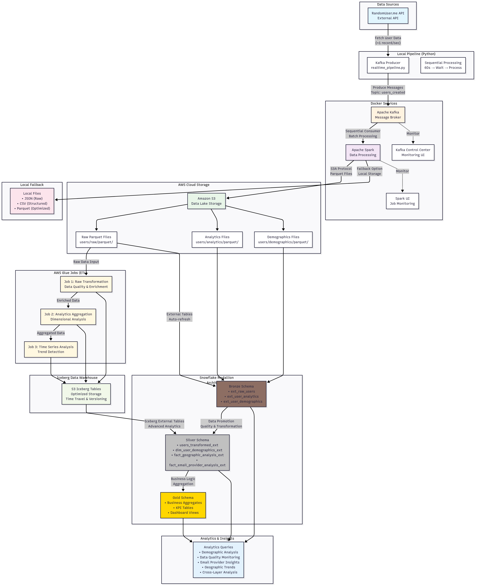

# Real-Time Data Pipeline Project

**What does this project do?**
This project automatically fetches random user data from an API, processes it through a streaming pipeline, and saves it to various formats for analysis. It's like a mini data factory that creates structured datasets from raw API data!

## How It Works

The current architecture of the project is as described below : 




### Simple Flow:
1. **Fetch Data**: Gets user data from RandomUser API (name, email, address, etc.)
2. **Stream Data**: Sends data through Kafka message queue for 60 seconds
3. **Process Data**: Spark processes all the data and creates analytics
4. **Save to S3**: Saves structured data to S3 data lake (and local files as fallback)
5. **Transform Data**: AWS Glue jobs enrich and process data into Iceberg tables
6. **Create Analytics**: Medallion architecture in Snowflake (Bronze → Silver → Gold schemas)
7. **Analyze**: Run comprehensive analytics queries across all data layers

## Quick Start (3 Steps!)

### Step 1: Setup
```bash
# Clone the project
git clone <your-repo-url>
cd data-project-1

# Install Python packages
pip install -r requirements.txt

# Start Docker services (Kafka + Spark)
docker-compose up -d
```

### Step 2: Run the Pipeline
```bash
python realtime_pipeline.py
```

**What happens:**
- Runs for 60 seconds fetching data
- Processes ~50 user records
- Creates files in `./output/` folder

### Step 3: Check Your Data
Look in the `./output/` folder for:
- `users_data.json` - Raw data
- `users_data.csv` - Spreadsheet-friendly format
- `users_spark_data.parquet/` - Optimized format for analytics

## What Data Do You Get?

Each user record includes:
- **Personal Info**: Name, gender, age, date of birth
- **Contact**: Email, phone, address
- **Account**: Username, registration date
- **Extra**: Profile picture URL

**Example:**
```json
{
  "id": "abc123",
  "first_name": "John",
  "last_name": "Doe",
  "email": "john.doe@example.com",
  "gender": "male",
  "address": "123 Main St, Anytown, USA",
  "age": 32
}
```

## 🔧 Optional: Cloud Setup

### For S3 Storage (Optional)
Create a `.env` file:
```bash
AWS_ACCESS_KEY_ID=your_key
AWS_SECRET_ACCESS_KEY=your_secret
S3_BUCKET_NAME=your-bucket-name
AWS_REGION=us-east-1
```

### For Snowflake Analytics (Optional)
Add to `.env`:
```bash
SNOWFLAKE_USER=your_user
SNOWFLAKE_PASSWORD=your_password
SNOWFLAKE_ACCOUNT=your_account

```

Then run:
```bash
python snowflake_connector.py
```

**Medallion Architecture**: Bronze layer (raw data) + Silver layer (processed data from Glue jobs) for comprehensive analytics.

## Advanced Features

### AWS Glue Jobs (For Big Data)
Automatically deployed via GitHub Actions:
- **Raw Transformation**: Clean and validate data
- **Analytics Aggregation**: Create summaries and metrics
- **Time Series Analysis**: Track trends over time

### Automated Deployment
Push to GitHub and everything deploys automatically:
```bash
git add .
git commit -m "deploy my changes"
git push origin main
```

## 🔍 Monitoring

**Check if everything is working:**
- Kafka UI: http://localhost:9021
- Spark UI: http://localhost:8080

## Troubleshooting

**Pipeline not working?**
1. Check Docker is running: `docker-compose ps`
2. Restart services: `docker-compose down && docker-compose up -d`
3. Check internet connection (needs API access)

**No data files?**
- Pipeline automatically creates fallback files even if cloud services fail
- Check `./output/` folder for local files

**Need help?**
- All logs are printed to console
- Check Docker logs: `docker-compose logs`

## File Structure

```
data-project-1/
├── realtime_pipeline.py      # Main script to run
├── docker-compose.yml        # Docker services
├── requirements.txt          # Python packages
├── .env.example             # Configuration template
├── output/                  # Your data files appear here
├── glue_jobs/              # Advanced AWS processing
├── snowflake/              # Analytics SQL scripts
└── scripts/                # Helper utilities
```

## Use Cases

This pipeline is perfect for:
- **Learning Data Engineering**: Hands-on experience with real tools
- **Prototyping**: Quick setup for data projects
- **Data Analysis**: Generate sample datasets for analysis
- **Testing**: Validate data processing workflows

## Contributing

1. Fork the repo
2. Make your changes
3. Test with `python realtime_pipeline.py`
4. Submit a pull request

## License

MIT License - feel free to use this project however you want!

---

**Questions?** Open an issue or check the detailed documentation in the `docs/` folder.
