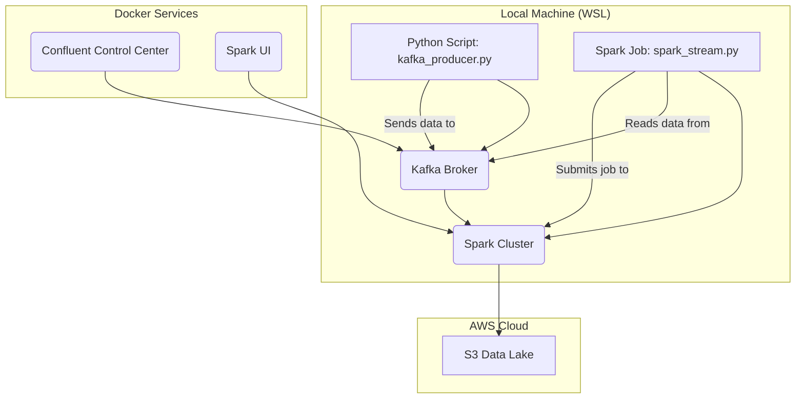

# Real-Time Data Pipeline Project

A sequential data pipeline that fetches user data from an external API, streams it through Apache Kafka, and processes it with either Apache Spark or a simple Kafka consumer, outputting structured data files.

## 🏗️ Architecture



### Pipeline Flow

1. **Data Generation**: Fetches random user data from [randomuser.me](https://randomuser.me) API
2. **Stream Processing**: Produces data to Kafka topic `users_created`
3. **Data Consumption**: Consumes all data using Spark (preferred) or simple Kafka consumer (fallback)
4. **Data Storage**: Saves processed data in multiple formats (JSON, CSV, Parquet)

## 🛠️ Prerequisites

### Required Software
- **Docker & Docker Compose**: For running Kafka and Spark services
- **Python 3.8+**: For running the pipeline
- **Git**: For version control

### Required Python Packages
```bash
pip install pyspark kafka-python requests pandas
```

## 🚀 Quick Start

### 1. Clone the Repository
```bash
git clone <repository-url>
cd data-project-1
```

### 2. Start Docker Services
```bash
docker-compose up -d
```

Wait for all services to be healthy (check with `docker-compose ps`).

### 3. Run the Pipeline
```bash
python realtime_pipeline.py
```

### 4. Check Results
After completion, check the `./output/` directory for generated files:
- `users_data.json` - Raw JSON data
- `users_data.csv` - Structured CSV data  
- `users_spark_data.parquet` - Optimized Parquet format (if Spark worked)

## 📋 Detailed Setup

### Docker Services Configuration

The `docker-compose.yml` includes:

| Service | Purpose | Port |
|---------|---------|------|
| **Zookeeper** | Kafka coordination | 2181 |
| **Kafka Broker** | Message streaming | 9092 |
| **Schema Registry** | Schema management | 8081 |
| **Control Center** | Kafka UI | 9021 |
| **Spark Master** | Spark cluster master | 8080, 7077 |
| **Spark Worker** | Spark execution | - |

### Environment Variables (Optional)

For S3 integration (advanced usage):
```bash
export AWS_ACCESS_KEY_ID="your_access_key"
export AWS_SECRET_ACCESS_KEY="your_secret_key"
```

## 🔧 Pipeline Configuration

### Producer Settings
- **API Source**: https://randomuser.me/api/
- **Topic**: `users_created`
- **Duration**: 60 seconds (configurable)
- **Rate**: ~1 record/second

### Consumer Options
1. **Spark Consumer** (Primary)
   - Reads all Kafka data in batch mode
   - Outputs Parquet files
   - Requires proper network configuration

2. **Simple Consumer** (Fallback)
   - Pure Kafka consumer
   - Outputs JSON and CSV files
   - More reliable across different environments

## 📊 Data Schema

Each record contains the following fields:

```json
{
  "id": "uuid4-string",
  "first_name": "string",
  "last_name": "string", 
  "gender": "string",
  "address": "string",
  "post_code": "string/number",
  "email": "string",
  "username": "string",
  "dob": "ISO-date-string",
  "registered_date": "ISO-date-string", 
  "phone": "string",
  "picture": "url-string"
}
```

## 📁 Project Structure

```
data-project-1/
├── README.md                 # This documentation
├── realtime_pipeline.py      # Main pipeline script
├── docker-compose.yml        # Docker services configuration
├── dbt_project/             # DBT transformations (optional)
├── postgres_init/           # Database initialization
├── output/                  # Generated output files
│   ├── users_data.json
│   ├── users_data.csv
│   └── users_spark_data.parquet
└── architecture.png         # Architecture diagram
```

## 🐛 Troubleshooting

### Common Issues

#### 1. Docker Services Not Starting
```bash
# Check service status
docker-compose ps

# View logs
docker-compose logs [service-name]

# Restart services
docker-compose down && docker-compose up -d
```

#### 2. Spark Connection Issues
- The pipeline automatically falls back to simple consumer if Spark fails
- Check Docker network connectivity
- Verify no port conflicts (7077, 8080)

#### 3. Kafka Connection Refused
```bash
# Verify Kafka is running
docker exec broker kafka-topics --bootstrap-server localhost:9092 --list

# Check if topic exists
docker exec broker kafka-console-consumer --bootstrap-server localhost:9092 --topic users_created --from-beginning --max-messages 1
```

#### 4. No Data Generated
- Check internet connectivity (API access)
- Verify Kafka producer logs
- Ensure sufficient disk space for output files

### Performance Tuning

#### For Large Data Volumes
```python
# Modify in realtime_pipeline.py
PRODUCER_DURATION = 300  # 5 minutes instead of 60 seconds
CONSUMER_TIMEOUT = 120   # Increase timeout
```

#### For Resource Constraints
```yaml
# In docker-compose.yml
environment:
  - SPARK_WORKER_MEMORY=512m
  - SPARK_WORKER_CORES=1
```

## 📈 Monitoring

### Kafka Control Center
Access the Kafka UI at http://localhost:9021 to monitor:
- Topic statistics
- Consumer lag
- Message throughput

### Spark UI
Access the Spark UI at http://localhost:8080 to view:
- Cluster status
- Job execution
- Resource utilization

## 🔄 Advanced Usage

### Custom Data Sources
Replace the `get_data()` function to use different APIs:

```python
def get_data():
    # Your custom API call here
    res = requests.get("your-api-endpoint")
    return res.json()
```

### S3 Integration
Set AWS credentials to enable S3 output:

```python
# Automatically detected in the pipeline
selection_df.write.mode("overwrite").parquet("s3a://your-bucket/path/")
```

### DBT Transformations
Use the included DBT project for advanced data transformations:

```bash
cd dbt_project
dbt run
```

## 📝 Development

### Running Tests
```bash
# Validate Kafka connectivity
python -c "from kafka import KafkaProducer; print('Kafka OK')"

# Test API connectivity
python -c "import requests; print(requests.get('https://randomuser.me/api/').status_code)"
```

### Adding Features
1. Fork the repository
2. Create a feature branch
3. Implement changes in `realtime_pipeline.py`
4. Test with various scenarios
5. Update documentation
6. Submit a pull request

## 📄 License

This project is licensed under the MIT License - see the LICENSE file for details.
