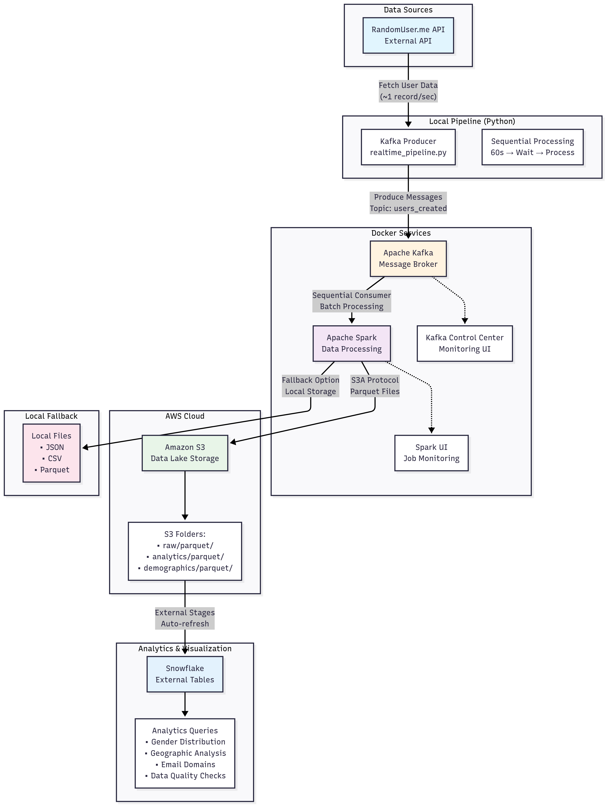

# Real-Time Data Pipeline Project

A sequential data pipeline that fetches user data from an external API, streams it through Apache Kafka, and processes it with either Apache Spark or a simple Kafka consumer, outputting structured data files.

## Architecture
The current architecture of the project is as described below




### Pipeline Flow

1. **Data Ingestion**: Fetches random user data from [randomuser.me](https://randomuser.me) API
2. **Message Streaming**: Produces data to Kafka topic `users_created` for 60 seconds
3. **Sequential Processing**: After producer completes, Spark consumer processes all messages in batch mode
4. **Data Transformation**: Spark creates structured analytics and demographics from raw data
5. **Cloud Storage**: Saves processed data to S3 in optimized Parquet format with organized folder structure
6. **Analytics Layer**: Snowflake external tables automatically read S3 data for real-time analytics
7. **Fallback Storage**: Local files (JSON/CSV/Parquet) for offline analysis and debugging

## Prerequisites

### Required Software
- **Docker & Docker Compose**: For running Kafka and Spark services
- **Python 3.8+**: For running the pipeline
- **Git**: For version control

### Required Python Packages
```bash
pip install -r requirements.txt
```

### Optional AWS Setup
For S3 data storage and analytics:
- **AWS Account** with S3 access
- **AWS CLI** configured or environment variables set

## Quick Start

### 1. Clone the Repository
```bash
git clone <repository-url>
cd data-project-1
```

### 2. Start Docker Services
```bash
docker-compose up -d
```

Wait for all services to be healthy (check with `docker-compose ps`).

### 3. Run the Pipeline
```bash
python realtime_pipeline.py
```

The pipeline runs sequentially:
1. **Producer Phase** (60 seconds): Fetches and streams user data to Kafka
2. **Wait Phase** (10 seconds): Allows Kafka to settle
3. **Consumer Phase** (2 minutes max): Processes all data and saves to files

### 4. Check Results
After completion, check the `./output/` directory for generated files:
- `users_data.json` - Raw JSON data from fallback consumer
- `users_data.csv` - Structured CSV data for spreadsheet analysis
- `users_spark_data.parquet/` - Optimized Parquet format from Spark processing

**S3 Output** (if configured):
- `s3://your-bucket/users/raw/parquet/` - Raw user data
- `s3://your-bucket/users/analytics/parquet/` - Gender, email domain analytics  
- `s3://your-bucket/users/demographics/parquet/` - Geographic demographics

## Detailed Setup

### Docker Services Configuration

The `docker-compose.yml` includes:

| Service | Purpose | Port |
|---------|---------|------|
| **Zookeeper** | Kafka coordination | 2181 |
| **Kafka Broker** | Message streaming | 9092 |
| **Schema Registry** | Schema management | 8081 |
| **Control Center** | Kafka UI | 9021 |
| **Spark Master** | Spark cluster master | 8080, 7077 |
| **Spark Worker** | Spark execution | - |

### S3 Configuration (Optional)

The pipeline automatically uploads data to S3 if configured. Create a `.env` file (copy from `env.example`):

```bash
# Copy the example file
cp env.example .env

# Edit with your AWS credentials
AWS_ACCESS_KEY_ID=your_access_key_here
AWS_SECRET_ACCESS_KEY=your_secret_key_here
S3_BUCKET_NAME=your-bucket-name-here
AWS_REGION=us-east-1
```

**S3 Folder Structure:**
- `users/raw/parquet/` - Raw user data in Parquet format
- `users/analytics/parquet/` - User analytics (gender distribution, email domains)
- `users/demographics/parquet/` - Geographic demographics (countries, states)

##  Pipeline Configuration

### Sequential Processing Flow
The pipeline operates in three distinct phases:

#### Phase 1: Data Production (60 seconds)
- **API Source**: https://randomuser.me/api/
- **Target Topic**: `users_created`
- **Rate**: ~1 record/second
- **Total Records**: ~50-60 user records

#### Phase 2: Kafka Settlement (10 seconds)
- Allows Kafka to complete message commits
- Ensures all data is available for consumption

#### Phase 3: Data Consumption (120 seconds max)
**Primary: Spark Consumer**
- Batch processing of all Kafka messages
- Creates structured analytics and demographics
- Outputs to S3 (if configured) and local Parquet files
- Includes data transformations and aggregations

**Fallback: Simple Kafka Consumer**
- Activates if Spark consumer fails
- Pure Python kafka-python implementation
- Outputs JSON and CSV files locally
- Ensures data is never lost

## Data Schema

Each record contains the following fields:

```json
{
  "id": "uuid4-string",
  "first_name": "string",
  "last_name": "string", 
  "gender": "string",
  "address": "string",
  "post_code": "string/number",
  "email": "string",
  "username": "string",
  "dob": "ISO-date-string",
  "registered_date": "ISO-date-string", 
  "phone": "string",
  "picture": "url-string"
}
```

## Snowflake Integration

Connect your pipeline data to Snowflake for advanced analytics and visualization.

### Quick Setup
```bash
# Add Snowflake credentials to .env
SNOWFLAKE_USER=INTERNPROJECT
SNOWFLAKE_PASSWORD=your_password
SNOWFLAKE_ACCOUNT=your_account-INTERNPROJECT
SNOWFLAKE_WAREHOUSE=INT_WH
SNOWFLAKE_DATABASE=ECOMMERCE_DATABASE
SNOWFLAKE_SCHEMA=STAGING

# Install Snowflake connector
pip install snowflake-connector-python==3.7.0

# Set up external tables automatically
python snowflake_connector.py

# Run sample analytics queries
python snowflake_connector.py query
```

### Features
- **External Tables**: Automatically read Parquet files from S3
- **Real-time Analytics**: Gender distribution, geographic analysis, email domains
- **Data Quality Monitoring**: Automated data validation and pipeline health checks
- **Sample Queries**: Pre-built analytics for common use cases

### SQL Scripts
- `snowflake/01_setup_stages.sql` - Create S3 external stages
- `snowflake/02_create_file_formats.sql` - Define Parquet file formats
- `snowflake/03_create_external_tables.sql` - Create external tables
- `snowflake/04_sample_queries.sql` - Analytics and monitoring queries

**Full Documentation**: See `snowflake/README.md` for detailed setup and usage instructions.

## Automated CI/CD Deployment

This project includes a complete CI/CD pipeline that automatically deploys your infrastructure when you push changes to GitHub.

### What Gets Deployed Automatically
- **Snowflake External Tables**: Automatically configured to read from your S3 bucket
- **AWS Glue Jobs**: Three advanced transformation jobs with Iceberg table support
- **IAM Roles and Permissions**: Proper security configuration for all services
- **Glue Database and Workflow**: Complete orchestration setup

### Quick Setup
1. **Validate your configuration**:
   ```bash
   python scripts/validate_setup.py
   ```

2. **Configure GitHub secrets** in your repository:
   - Go to Settings → Secrets and variables → Actions
   - Add AWS and Snowflake credentials (see [CI/CD Setup Guide](docs/CICD_SETUP.md))

3. **Deploy automatically**:
   ```bash
   git add .
   git commit -m "deploy: trigger automated infrastructure deployment"
   git push origin main
   ```

4. **Monitor deployment** in GitHub Actions and run jobs in AWS Console

### AWS Glue Jobs Created
- **data-pipeline-raw-transformation**: Data validation, cleansing, and enrichment
- **data-pipeline-analytics-aggregation**: Dimensional analytics and aggregations  
- **data-pipeline-time-series-analysis**: Trend detection and time series analysis

### Benefits
- **Zero Manual Setup**: Everything deploys automatically
- **Version Control**: Infrastructure changes tracked in Git
- **Rollback Capability**: Easy to revert problematic deployments
- **Monitoring**: Complete logging and error tracking
- **Scalability**: Production-ready configuration

**Complete Documentation**: See [CI/CD Setup Guide](docs/CICD_SETUP.md) for detailed configuration instructions.

## Project Structure

```
data-project-1/
├── README.md                 # This documentation
├── realtime_pipeline.py      # Main pipeline script
├── snowflake_connector.py    # Snowflake integration
├── docker-compose.yml        # Docker services configuration
├── requirements.txt          # Python dependencies
├── .github/workflows/        # CI/CD automation
│   └── deploy-pipeline.yml   # GitHub Actions workflow
├── docs/                     # Documentation
│   └── CICD_SETUP.md        # CI/CD setup guide
├── scripts/                  # Utility scripts
│   └── validate_setup.py    # Pre-deployment validation
├── glue_jobs/               # AWS Glue ETL jobs
│   ├── 01_raw_data_transformation.py
│   ├── 02_analytics_aggregation.py
│   ├── 03_time_series_analysis.py
│   └── glue_job_config.py   # Deployment configuration
├── snowflake/               # Snowflake SQL scripts and docs
│   ├── README.md
│   ├── 01_setup_stages.sql
│   ├── 02_create_file_formats.sql
│   ├── 03_create_external_tables.sql
│   └── 04_sample_queries.sql
├── dbt_project/             # DBT transformations (optional)
├── postgres_init/           # Database initialization
└── output/                  # Generated output files
```

##  Troubleshooting

### Common Issues

#### 1. Docker Services Not Starting
```bash
# Check service status
docker-compose ps

# View logs
docker-compose logs [service-name]

# Restart services
docker-compose down && docker-compose up -d
```

#### 2. Spark Connection Issues
- The pipeline automatically falls back to simple consumer if Spark fails
- Check Docker network connectivity
- Verify no port conflicts (7077, 8080)

#### 3. Kafka Connection Refused
```bash
# Verify Kafka is running
docker exec broker kafka-topics --bootstrap-server localhost:9092 --list

# Check if topic exists
docker exec broker kafka-console-consumer --bootstrap-server localhost:9092 --topic users_created --from-beginning --max-messages 1
```

#### 4. No Data Generated
- Check internet connectivity (API access)
- Verify Kafka producer logs
- Ensure sufficient disk space for output files

### Performance Tuning

#### For Large Data Volumes
```python
# Modify in realtime_pipeline.py
PRODUCER_DURATION = 300  # 5 minutes instead of 60 seconds
CONSUMER_TIMEOUT = 120   # Increase timeout
```

#### For Resource Constraints
```yaml
# In docker-compose.yml
environment:
  - SPARK_WORKER_MEMORY=512m
  - SPARK_WORKER_CORES=1
```

## Monitoring

### Kafka Control Center
Access the Kafka UI at http://localhost:9021 to monitor:
- Topic statistics
- Consumer lag
- Message throughput

### Spark UI
Access the Spark UI at http://localhost:8080 to view:
- Cluster status
- Job execution
- Resource utilization

## Advanced Usage

### Custom Data Sources
Replace the `get_data()` function to use different APIs:

```python
def get_data():
    # Your custom API call here
    res = requests.get("your-api-endpoint")
    return res.json()
```

### S3 Integration
Set AWS credentials to enable S3 output:

```python
# Automatically detected in the pipeline
selection_df.write.mode("overwrite").parquet("s3a://your-bucket/path/")
```

### DBT Transformations
Use the included DBT project for advanced data transformations:

```bash
cd dbt_project
dbt run
```

## Development

### Running Tests
```bash
# Validate Kafka connectivity
python -c "from kafka import KafkaProducer; print('Kafka OK')"

# Test API connectivity
python -c "import requests; print(requests.get('https://randomuser.me/api/').status_code)"
```

### Adding Features
1. Fork the repository
2. Create a feature branch
3. Implement changes in `realtime_pipeline.py`
4. Test with various scenarios
5. Update documentation
6. Submit a pull request

## License

This project is licensed under the MIT License - see the LICENSE file for details.
