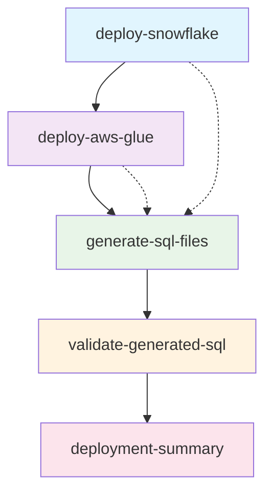

# CI/CD Workflow Documentation

## Overview

The project uses a single, comprehensive GitHub Actions workflow (`deploy-pipeline.yml`) that handles both infrastructure deployment and SQL generation. This unified approach ensures consistent execution order and better dependency management.

## Workflow Structure

### 🔄 Trigger Conditions

The workflow can be triggered in several ways:

1. **Automatic Triggers:**
   - Push to `main` or `develop` branches (with changes to `glue_jobs/`, `snowflake/`, or workflow files)
   - Pull requests to `main` branch

2. **Manual Trigger (`workflow_dispatch`):**
   - Select target environment (dev/staging/prod)
   - Option to skip deployment (SQL generation only)

### 🏗️ Job Execution Flow



#### Job 1: 🏔️ Deploy Snowflake Infrastructure
- **Condition:** Only runs on `main` branch and when deployment is not skipped
- **Purpose:** Sets up Snowflake external tables and connections
- **Dependencies:** None
- **Credentials Required:** Snowflake and AWS secrets

#### Job 2: ⚡ Deploy AWS Glue Jobs
- **Condition:** Only runs on `main` branch and when deployment is not skipped
- **Purpose:** Creates AWS Glue jobs, IAM roles, and catalog tables
- **Dependencies:** `deploy-snowflake`
- **Credentials Required:** AWS secrets

#### Job 3: 🔧 Generate SQL Files
- **Condition:** Always runs if previous jobs succeed or are skipped
- **Purpose:** Generates environment-specific SQL files from templates
- **Dependencies:** `deploy-snowflake` AND `deploy-aws-glue` (with OR logic for skipped)
- **Credentials Required:** None (uses environment variables only)

#### Job 4: ✅ Validate Generated SQL
- **Condition:** Runs if SQL generation succeeds
- **Purpose:** Validates generated SQL files for syntax and content
- **Dependencies:** `generate-sql-files`
- **Credentials Required:** None

#### Job 5: 📋 Deployment Summary
- **Condition:** Always runs (final summary)
- **Purpose:** Provides comprehensive deployment status report
- **Dependencies:** All previous jobs
- **Credentials Required:** None

## Environment Determination

The workflow automatically determines the target environment:

| Trigger | Branch | Environment |
|---------|--------|-------------|
| Push | `main` | `prod` |
| Push | `develop` | `staging` |
| Push | other | `dev` |
| Manual | any | User-selected |
| PR | any | `dev` |

## Configuration

### Environment Variables (Public)
```yaml
# SQL Generation (no credentials)
SNOWFLAKE_DATABASE_DEV: "ECOMMERCE_DB"
SNOWFLAKE_DATABASE_STAGING: "ECOMMERCE_STAGING_DB" 
SNOWFLAKE_DATABASE_PROD: "ECOMMERCE_PROD_DB"
SNOWFLAKE_WAREHOUSE_DEV: "INT_WH"
SNOWFLAKE_WAREHOUSE_STAGING: "COMPUTE_WH_STAGING"
SNOWFLAKE_WAREHOUSE_PROD: "COMPUTE_WH_PROD"
S3_BUCKET_DEV: "my-amazing-app"
S3_BUCKET_STAGING: "my-amazing-app-staging"
S3_BUCKET_PROD: "my-amazing-app-prod"

# AWS Configuration
AWS_REGION: us-east-1
GLUE_ROLE_NAME: data-engineer-user
GLUE_DATABASE_NAME: data_pipeline_db
S3_SCRIPTS_PREFIX: glue-scripts/
```

### Required Secrets
```yaml
# AWS Credentials
AWS_ACCESS_KEY_ID: <your-aws-access-key>
AWS_SECRET_ACCESS_KEY: <your-aws-secret-key>
AWS_REGION: <your-aws-region>

# Snowflake Credentials
SNOWFLAKE_USER: <your-snowflake-user>
SNOWFLAKE_PASSWORD: <your-snowflake-password>
SNOWFLAKE_ACCOUNT: <your-snowflake-account>
SNOWFLAKE_WAREHOUSE: <your-snowflake-warehouse>
SNOWFLAKE_DATABASE: <your-snowflake-database>
SNOWFLAKE_SCHEMA: <your-snowflake-schema>

# S3 Configuration
S3_BUCKET_NAME: <your-s3-bucket-name>
```

## Usage Scenarios

### 1. Full Deployment (Production)
```bash
# Triggered automatically on push to main
git push origin main
```
- Deploys Snowflake infrastructure
- Deploys AWS Glue jobs
- Generates production SQL files
- Validates all outputs

### 2. SQL Generation Only
```bash
# Manual trigger via GitHub UI
# Select "Skip AWS/Snowflake deployment" = true
# Choose target environment
```
- Skips infrastructure deployment
- Only generates and validates SQL files
- Useful for template testing

### 3. Development Testing
```bash
# Push to feature branch
git push origin feature/my-changes
```
- Generates dev environment SQL files
- Validates templates
- No infrastructure deployment

### 4. Staging Deployment
```bash
# Push to develop branch
git push origin develop
```
- Generates staging environment SQL files
- Can include infrastructure deployment if on main

## Artifacts and Outputs

### Generated Artifacts
- **SQL Files:** Environment-specific SQL files uploaded as GitHub artifacts
- **Retention:** 30 days
- **Naming:** `snowflake-sql-{environment}`

### Summary Reports
- **SQL Generation Summary:** Lists all generated files with sizes
- **Validation Report:** Detailed validation results for each file
- **Deployment Summary:** Overall status of all pipeline components

## Monitoring and Troubleshooting

### Common Issues

1. **YAML Syntax Errors**
   - Check for proper indentation
   - Validate quotes and special characters
   - Use YAML validators

2. **Missing Secrets**
   - Verify all required secrets are configured in repository settings
   - Check secret names match exactly

3. **Permission Issues**
   - Ensure AWS credentials have required permissions
   - Verify Snowflake user has necessary privileges

4. **Template Errors**
   - Check template syntax in `snowflake/` directory
   - Ensure all variables are properly formatted (`${VARIABLE_NAME}`)

### Debugging Steps

1. **Check Workflow Logs**
   - Go to Actions tab in GitHub
   - Click on failed workflow run
   - Examine individual job logs

2. **Validate Templates Locally**
   ```bash
   make validate-templates
   python scripts/generate_snowflake_sql.py dev
   ```

3. **Test SQL Generation**
   ```bash
   make generate-sql ENV=dev
   make test-sql
   ```

## Security Considerations

### Credential Management
- ✅ All credentials stored as GitHub secrets
- ✅ No credentials in generated SQL files
- ✅ Environment variables for non-sensitive configuration
- ✅ Minimal required permissions

### Access Control
- ✅ Workflow only runs on authorized branches
- ✅ Manual triggers require repository access
- ✅ Secrets only accessible during workflow execution

## Customization

### Adding New Environments
1. Add environment variables to workflow
2. Update `config/environments.yaml`
3. Modify environment determination logic
4. Test with manual trigger

### Adding New SQL Templates
1. Create template file in `snowflake/` directory
2. Add to template list in generation script
3. Update documentation
4. Test generation and validation

### Modifying Validation Rules
1. Edit validation logic in workflow
2. Update local script validation
3. Test with various template scenarios
4. Document new validation rules

## Best Practices

1. **Template Development**
   - Always test locally before committing
   - Use descriptive variable names
   - Include proper SQL comments
   - Follow consistent formatting

2. **Workflow Management**
   - Use meaningful commit messages
   - Test changes in feature branches
   - Review generated artifacts before deployment
   - Monitor workflow execution regularly

3. **Environment Management**
   - Keep environment configurations consistent
   - Use appropriate naming conventions
   - Document environment-specific requirements
   - Regularly review and update configurations 